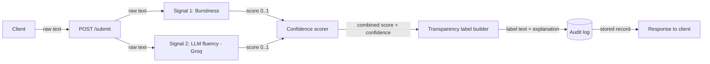

# Provenance Guard — Planning

## Milestone 1: System Understanding & Architecture

---

## 1. Architecture Narrative — the path one piece of text takes

A creator pastes a block of text and submits it. Here is the full journey of that
text, naming every component it touches and what each one does.

1. **Client → `POST /submit`.** The creator sends raw text (and optionally an author
   id) to the submission endpoint. The **rate limiter** (flask-limiter) checks first
   that this client hasn't exceeded its request budget; if it has, the request is
   rejected before any work happens. The endpoint then validates the input (non-empty,
   long enough to analyze) and mints a unique **submission id**.

2. **Raw text → Signal 1 (Burstiness analyzer).** The text is passed to the first
   detector, a pure-Python statistical function. It splits the text into sentences,
   measures the variation in sentence length, and returns a normalized score in
   `[0,1]` representing *how AI-like the structural rhythm is*. No network call.

3. **Raw text → Signal 2 (LLM fluency judge, via Groq).** The same text is sent to the
   Groq API with a structured prompt asking the model to rate how formulaic / low-
   surprise / "machine-smooth" the prose reads. The model returns a score that I
   normalize to `[0,1]` representing *how AI-like the phrasing is*.

4. **Two signal scores → Confidence scorer.** A combiner takes both normalized scores
   and produces (a) a single **combined AI-likelihood score** and (b) a **confidence**
   value. Crucially, confidence is reduced when the two signals *disagree* — two
   independent detectors pointing in opposite directions is exactly the situation where
   the system should admit it is unsure.

5. **Combined score + confidence → Transparency label.** The label builder maps the
   numbers onto a human-readable verdict band ("Likely human-written", "Likely
   AI-generated", or "Uncertain / mixed signals") and attaches a plain-English
   explanation, the per-signal breakdown, and the score. It never emits a bare
   accusation — the output is always probabilistic and shows its work.

6. **Everything → Audit log.** Before responding, the system appends an immutable
   record: submission id, a hash of the text (not the raw text), both signal scores,
   the combined score, the label, and a timestamp. This is the accountability trail.

7. **Audit record → Response.** The endpoint returns the submission id, both signal
   scores, the combined score, the label, and the explanation to the creator.

If the creator believes the label is wrong, a second flow begins:

8. **Client → `POST /appeal`.** The creator sends the submission id and a reason. The
   system looks up the original record, sets its **status** to `appealed / under
   review`, writes a new **audit log** entry capturing the status change, and returns
   the appeal id and new status. A human reviewer can later override the label, and
   that override is itself logged.

---

## 2. The two detection signals

I deliberately chose one **cheap, deterministic, structural** signal and one
**richer, semantic** signal so they fail in *different* ways. Their disagreement is
information, not noise.

### Signal 1 — Burstiness (sentence-length variation)

- **What it measures:** the spread (standard deviation, normalized by the mean) of
  sentence lengths across the text — i.e. how much the rhythm varies.
- **Why it differs between human and AI:** human writing is "bursty." People mix a
  short, punchy sentence with a long winding one because emphasis and thought are
  uneven. LLMs decode by picking high-probability continuations, which tends to
  produce evenly-paced, medium-length, structurally uniform sentences. **Low
  burstiness → more AI-like.**
- **What it can't capture (blind spot):** it is blind to *meaning* and to register.
  A human writing in a rigid format — a lab report, legal boilerplate, a student
  following a strict template — also produces uniform sentence lengths and will be
  flagged as AI (a false positive). It is also unreliable on short text (you can't
  estimate variance from two sentences), and a person can trivially defeat it by
  varying sentence length on purpose.

### Signal 2 — LLM fluency / perplexity judgment (Groq)

- **What it measures:** how formulaic and low-surprise the phrasing is — whether the
  text reads like high-likelihood generated prose (even tone, hedging, formulaic
  transitions like "Moreover," / "In conclusion,", absence of idiosyncratic voice).
- **Why it differs between human and AI:** AI text is sampled from high-probability
  tokens, so it is unusually smooth and "low-perplexity." Human text carries more
  surprising, lower-probability word choices, personal voice, and the occasional typo
  or rough edge. **Smoother / more predictable → more AI-like.**
- **What it can't capture (blind spot):** a genuinely fluent human writer, or any text
  that has been edited/polished, also reads smoothly and gets flagged (false positive).
  The judge is itself a probabilistic model — it can be confidently wrong, can be
  prompt-gamed, performs worse on short text and on domains/languages it saw little of,
  and may invent a plausible-sounding rationale for a wrong score.

**Why these two together:** burstiness is structural and free but shallow; the LLM
judge is semantic and deep but expensive and fallible. They share *almost no* failure
mode except "polished formal human writing," which is precisely the case I design the
confidence score and appeal flow to protect.

---

## 3. The false-positive problem (traced through the system)

**Scenario:** A meticulous human writes a polished, formal cover letter. Its sentences
are uniform in length (→ Signal 1 scores it AI-like) and its prose is smooth and well-
edited (→ Signal 2 scores it AI-like). Both signals agree, and *both are wrong.*

Tracing it through:

- **Confidence score:** here the danger is real — because both signals agree, the
  disagreement-penalty does *not* fire, so confidence stays high. My system does not
  pretend this away. Instead the protection is structural, not numerical: the label is
  always phrased as a probability ("**Likely** AI-generated, score 0.81"), never as a
  verdict ("This is AI"), and it always shows the two signal scores and the caveat that
  *formal, polished human writing is the known failure mode of both signals.* A reader
  is given the means to doubt the label.
- **The label the user sees:** "Likely AI-generated (0.81). Note: short, formal, or
  heavily-edited human writing can score this way. If this is your original work, you
  can appeal." Transparency turns a silent misjudgment into a contestable one.
- **How the creator appeals:** they call `POST /appeal` with the submission id and a
  reason. The record's status flips to `under review`, the change is written to the
  audit log, and a human can override the label — with the override also logged.

**What this teaches Milestone 2:** (1) never present detection as ground truth — always
expose the score and per-signal breakdown; (2) bias the decision threshold so the system
is reluctant to flag a human (favor false negatives over false positives, because
falsely accusing a real creator is the higher-harm error); (3) make the appeal path
frictionless and fully audited.

---

## 4. API surface (the contract)

| Method & path | Accepts | Returns |
|---|---|---|
| `POST /submit` | `{ "text": str, "author"?: str }` | `{ id, signals: { burstiness, llm_fluency }, combined_score, confidence, label, explanation, timestamp }` |
| `GET /result/<id>` | path param `id` | the stored result for that submission (same shape as `/submit`) + current `status` |
| `POST /appeal` | `{ "submission_id": str, "reason": str, "author"?: str }` | `{ appeal_id, submission_id, status, timestamp }` |
| `GET /audit` | optional `?submission_id=` filter | append-only list of audit entries (submissions, labels, appeals, overrides) |
| `GET /health` | — | `{ status: "ok" }` |

Notes on the contract:
- `combined_score` and each signal are floats in `[0,1]` (1 = most AI-like).
- `label` is one of `likely_human`, `uncertain`, `likely_ai`.
- Rate limiting (flask-limiter) applies to `POST /submit` and `POST /appeal`.
- Errors return a JSON body `{ error, detail }` with the appropriate 4xx/5xx status
  (e.g. 400 empty/too-short text, 404 unknown submission id, 429 rate-limited).
- The audit log stores a **hash** of the text, never the raw text.

---

## 5. Flow diagrams

### Flow 1 — Submission



Arrow contents: `raw text` → both signals; each signal returns a `normalized score
0..1`; the scorer emits `combined score + confidence`; the label builder emits
`label text + explanation`; the audit log persists the full `record`; the response
carries `id + scores + label + explanation` back to the client.

### Flow 2 — Appeal


Arrow contents: client sends `submission_id + reason`; the endpoint performs a
`lookup` and a `status update`; the `status change` is appended to the audit log; the
response carries `appeal_id + new status` back to the client.

### ASCII fallback

```
SUBMIT:
  client --text--> /submit --text--> [Signal 1 burstiness] --0..1--\
                              \--text--> [Signal 2 LLM/Groq] --0..1--> [confidence scorer]
                                                                          |
                                            combined score + confidence  v
                                                              [transparency label]
                                                                          | label+explanation
                                                                          v
                                                                    [audit log] --record--> response

APPEAL:
  client --id+reason--> /appeal --lookup--> [status: under review] --change--> [audit log] --> response
```

---

## Open decisions to confirm before Milestone 2
- Exact band thresholds for `likely_human` / `uncertain` / `likely_ai`.
- The disagreement penalty formula for confidence.
- Storage backend for the audit log (in-memory dict for the prototype vs. a JSON file
  for persistence across restarts).
